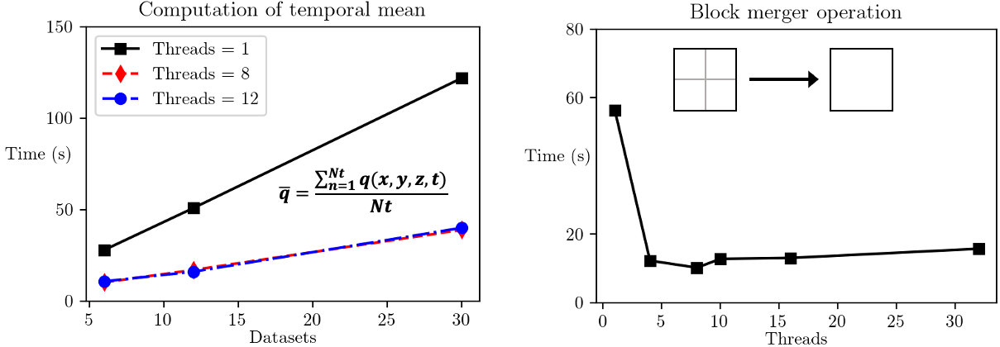

###############
 |icon| BoxKit
###############

|Code style: black|

|FlashX| |FlowX| |Minimal| |Publish| |Linting|

**********
 Overview
**********

An overview of BoxKit is available in ``paper/paper.md`` that provides a
summary and statement of need for the package. You can compile it into a
pdf by running ``make`` in the ``paper`` directory. Please note that the
``Makefile`` requires a functioning Docker service on the machine.

**************
 Installation
**************

Stable releases of BoxKit are hosted on Python Package Index website
(https://pypi.org/project/BoxKit/) and can be installed by executing,

.. code::

   pip install BoxKit --user

Note that ``pip`` should point to ``python3+`` installation package
``pip3``.

Upgrading and uninstallation is easily managed through this interface
using,

.. code::

   pip install --upgrade BoxKit --user
   pip uninstall BoxKit

Pre-release version can be installed directly from the git reposity by
executing,

.. code::

   pip install git+ssh://git@github.com/akashdhruv/BoxKit.git --user

BoxKit provides various installation options that can be used to
configure the library with desired features. Following is a list of
options,

.. code::

   with-cbox      - With C++ backend
   with-pyarrow   - With Apache Arrow data backend
   with-zarr      - With Zarr data backend
   with-dask      - With Dask data/parallel backend
   enable-testing - Enabling testing mode for development

Correspondingly, the installation command can be modified to include
necessary options as follows,

.. code::

   export CXX=$(CPP_COMPILER)
   pip install BoxKit --user --install-option="--enable-testing" --install-option="--with-cbox"

There maybe situations where users may want to install BoxKit in
development mode $\\textemdash$ to design new features, debug, or
customize classes/methods to their needs. This can be easily
accomplished using the ``setup`` script located in the project root
directory and executing,

.. code::

   ./setup develop

Development mode enables testing of features/updates directly from the
source code and is an effective method for debugging. Note that the
``setup`` script relies on ``click``, which can be installed using,

.. code::

   pip install click

*******
 Usage
*******

After ``pip`` installation, BoxKit can be imported inside Python
environment by adding the following to iPython notebooks and scripts,

.. code:: python

   import boxkit

Once the library is imported in the environment, simulation datasets can
be read by executing,

.. code:: python

   dset = boxkit.read_dataset(path_to_hdf5_file, source="flash")

New datasets can be created using the ``create_dataset`` method

.. code:: python

   dset = boxkit.create_dataset(*args, **kwargs)

A full of list of arguments can be found in the documentation.

*************
 Performance
*************

|performance|

*********
 Testing
*********

Testing for BoxKit is performed across different hardware platforms
where high-fidelity simulation data can reside. The sites $\\textemdash$
acadia and sedona refer to a Mac and Ubuntu operating systems
respectively where regular testing takes place.

For lightweight testing during pull requests and merger, new tests can
be added to ``tests/container``. Each test should be accompanied with a
coresspoding addition to YAML files located under ``.github/workflows``.
See ``tests/container/heater.py`` and ``.github/workflows/flashx.yaml``
for an example.

**********
 Citation
**********

.. code::

   @software{akash_dhruv_2023_8063195,
     author       = {Akash Dhruv},
     title        = {akashdhruv/BoxKit: June 2023},
     month        = jun,
     year         = 2023,
     publisher    = {Zenodo},
     version      = {2023.06},
     doi          = {10.5281/zenodo.8063195},
     url          = {https://doi.org/10.5281/zenodo.8063195}
   }

**************
 Contribution
**************

Developers are encouraged to fork the repository and contribute to the
source code in the form of pull requests to the ``development`` branch.
Please read ``DESIGN.rst`` for an overview of software design and
developer guide

****************
 Help & Support
****************

Please file an issue on the repository page to report bugs, request
features, and ask questions about usage

.. |Code style: black| image:: https://img.shields.io/badge/code%20style-black-000000.svg
   :target: https://github.com/psf/black

.. |FlashX| image:: https://github.com/akashdhruv/BoxKit/workflows/FlashX/badge.svg

.. |FlowX| image:: https://github.com/akashdhruv/BoxKit/workflows/FlowX/badge.svg

.. |Minimal| image:: https://github.com/akashdhruv/BoxKit/workflows/Minimal/badge.svg

.. |Publish| image:: https://github.com/akashdhruv/BoxKit/workflows/Publish/badge.svg

.. |Linting| image:: https://github.com/akashdhruv/BoxKit/workflows/Linting/badge.svg

.. |icon| image:: ./media/icon.svg
   :width: 30

