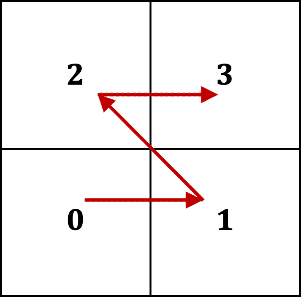

###############
 |icon| BoxKit
###############

|Code style: black|

|FlashX| |FlowX| |Minimal| |Publish| |Linting|

**********
 Overview
**********

BoxKit is a library that provides building blocks to parallelize and
scale data science, statistical analysis, and machine learning
applications for block-structured simulation datasets. Spatial data from
simulations can be accessed and managed using tools available in this
library to interface with packages like SciKit, PyTorch, and OpticalFlow
for post-processing and analysis.

The library provides a Python interface to efficiently access Adaptive
Mesh Refinement (AMR) data typical of simulation outputs, and leverages
multiprocessing libraries like JobLib and Dask to scale analysis on
Non-Uniform Memory Access (NUMA) and distributed computing
architectures.

**************
 Installation
**************

Stable releases of BoxKit are hosted on Python Package Index website
(https://pypi.org/project/BoxKit/) and can be installed by executing,

.. code::

   pip install BoxKit --user

Note that ``pip`` should point to ``python3+`` installation package
``pip3``.

Upgrading and uninstallation is easily managed through this interface
using,

.. code::

   pip install --upgrade BoxKit --user
   pip uninstall BoxKit

Pre-release version can be installed directly from the git reposity by
executing,

.. code::

   pip install git+ssh://git@github.com/Box-Tools/BoxKit.git --user

BoxKit provides various installation options that can be used to
configure the library with desired features. Following is a list of
options,

.. code::

   with-cbox      - With C++ backend
   with-pyarrow   - With Apache Arrow data backend
   with-zarr      - With Zarr data backend
   with-dask      - With Dask data/parallel backend
   enable-testing - Enabling testing mode for development

Correspondingly, the installation command can be modified to include
necessary options as follows,

.. code::

   export CXX=$(CPP_COMPILER)
   pip install BoxKit --user --install-option="--enable-testing" --install-option="--with-cbox"

There maybe situations where users may want to install BoxKit in
development mode $\\textemdash$ to design new features, debug, or
customize classes/methods to their needs. This can be easily
accomplished using the ``setup`` script located in the project root
directory and executing,

.. code::

   ./setup develop

Development mode enables testing of features/updates directly from the
source code and is an effective method for debugging. Note that the
``setup`` script relies on ``click``, which can be installed using,

.. code::

   pip install click

The ``setup`` command acts a wrapper over ``setup.py`` to provide a
developer friendly interface. The ``--help`` option provides
instructions on how to configure installation with different options,

.. code::

   ./setup --help
   ./setup develop --help

*******
 Usage
*******

After ``pip`` installation, BoxKit can be imported inside Python
environment by adding the following to iPython notebooks and scripts,

.. code:: python

   import boxkit

Once the library is imported in the environment, simulation datasets can
be read by executing,

.. code:: python

   # Read dataset from a Flash-X simulation
   dset = boxkit.read_dataset(path_to_hdf5_file, source="flash")

New datasets can be created using the ``create_dataset`` method

.. code:: python

   # Create a dataset using custom attributes
   dset = boxkit.create_dataset(**attributes)

Following is an example on how to create a block-structured dataset in
BoxKit and use its interface. Similar functionality exists for datasets
that are read from a simulation source like Flash-X
(https://flash-x.org)

.. code:: python

   # Create a two-dimensional dataset with 25 blocks of size 4x4
   dset = boxkit.create_dataset(xmin=0,xmax=1,ymin=0,ymax=1,nxb=4,nyb=4,nblockx=5,nblocky=5)

.. code::

   print(dset)

   Dataset:
   - type         : <class 'boxkit.library._dataset.Dataset'>
   - file         : None
   - keys         : []
   - dtype      : []
   - bound(z-y-x) : [0.0, 1.0] x [0.0, 0.8] x [0.0, 1.6]
   - shape(z-y-x) : 1 x 4 x 4
   - guard(z-y-x) : 0 x 0 x 0
   - nblocks      : 25
   - dtype        : {}

Next add a solution variable using,

.. code:: python

   # Add a solution variable to the dataset
   dset.addvar("soln")

This creates a numpy memmap for solution variable and stores it on disk.
The data can be accessed directly using ``dset["soln"]``. When dataset
is read from HDF5 source using ``read_dataset``, like Flash-X
simulations, then its representation on the disk is in the form of
``h5py`` objects.

.. code::

   print(numpy.shape(dset["soln"])
   (25, 1, 4, 4)

The example dataset here contains 25 blocks that are arranged using a
space-filling morton order as below,

|morton|

Solution data local to individual blocks can be accessed by looping over
a dataset's ``blocklist``

.. code:: python

   for block in dset.blocklist:
       print(block["soln"])

BoxKit also offers wrappers to scale the process of deploying workflows
on NUMA and distributed computing architectures by providing decorators
that can parallelize Python operations over a single data structure to
operate over a list,

.. code:: python

   from boxkit.library import Action

   # Decorate function on a block with desired configuration for parallelization
   @Action(num_procs, parallel_backend)
   def operation_on_block(block, *args):
       pass

   # Call the function with list of blocks as the first argument
   operation_on_block((block for block in list_of_blocks), *args)

The ``Action`` wrapper converts the function, ``operation_on_block``,
into a parallel method which can be deployed on a multinode cluster with
the desired backend (JobLib/Dask). BoxKit does not interfere with
parallelization schema of target applications like SciKit, OpticalFlow,
and PyTorch which function independently using available resources.

Detailed information on full functionality is availabe in documentation
(https://box-tools.github.io/BoxKit/).

**************
 Contribution
**************

Developers are encouraged to fork the repository and contribute to the
source code in the form of pull requests to the ``development`` branch.
Please read documentation (https://box-tools.github.io/BoxKit/) for an
overview of software design and developer guide

*********
 Testing
*********

Testing for BoxKit is performed across different hardware platforms
where high-fidelity simulation data can reside. The sites $\\textemdash$
acadia and sedona refer to a Mac and Ubuntu operating systems
respectively where regular testing takes place.

For lightweight testing during pull requests and merger, new tests can
be added to ``tests/container``. Each test should be accompanied with a
coresspoding addition to YAML files located under ``.github/workflows``.
See ``tests/container/heater.py`` and ``.github/workflows/flashx.yaml``
for an example.

**********
 Citation
**********

.. code::

   @software{akash_dhruv_2023_8063195,
     author       = {Akash Dhruv},
     title        = {akashdhruv/BoxKit: June 2023},
     month        = jun,
     year         = 2023,
     publisher    = {Zenodo},
     version      = {2023.06},
     doi          = {10.5281/zenodo.8063195},
     url          = {https://doi.org/10.5281/zenodo.8063195}
   }

****************
 Help & Support
****************

Please file an issue on the repository page to report bugs, request
features, and ask questions about usage

***********
 Tutorials
***********

.. toctree::
   :glob:

   tutorials/astrophysics_example_01/*
   tutorials/pool_boiling_gravity/*

.. |Code style: black| image:: https://img.shields.io/badge/code%20style-black-000000.svg
   :target: https://github.com/psf/black

.. |FlashX| image:: https://github.com/Box-Tools/BoxKit/workflows/FlashX/badge.svg

.. |FlowX| image:: https://github.com/Box-Tools/BoxKit/workflows/FlowX/badge.svg

.. |Minimal| image:: https://github.com/Box-Tools/BoxKit/workflows/Minimal/badge.svg

.. |Publish| image:: https://github.com/Box-Tools/BoxKit/workflows/Publish/badge.svg

.. |Linting| image:: https://github.com/Box-Tools/BoxKit/workflows/Linting/badge.svg

.. |icon| image:: ./media/icon.svg
   :width: 30

