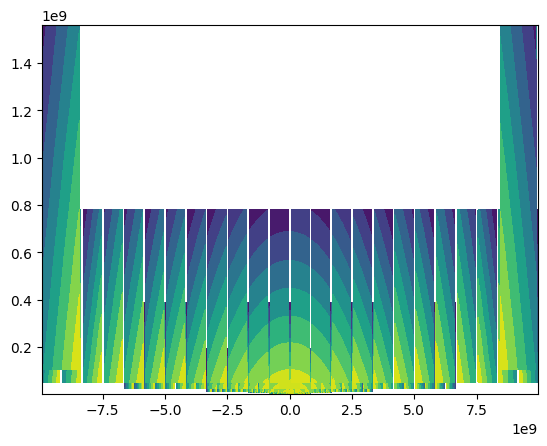

#### In this example we will use BoxKit to work with three dimensional astrophysics data. After performing the required installation steps we are read to import BoxKit into Python environment


```python
import boxkit
```

#### Next we read and parse dataset information from a HDF5 file, `25m_3d_32km_hdf5_plt_cnt_1000`, that contains Flash-X simulation output


```python
dset = boxkit.read_dataset("25m_3d_32km_hdf5_plt_cnt_1000", source="flash")
```

#### We can probe into the information for this dataset by using a simple print statement


```python
print(dset)
```

    Dataset:
     - type         : <class 'boxkit.library._dataset.Dataset'>
     - file         : <HDF5 file "25m_3d_32km_hdf5_plt_cnt_1000" (mode r)>
     - keys         : ['dens', 'temp', 'velx', 'vely', 'ye  ', 'fe54', 'fe56', 'o16 ', 'si28', 'entr', 'enuc', 'cr48', 'cr56', 'fe52', 'ni56', 'pres', 'c12 ', 's32 ', 'gpot', 'gamc', 'dtbn', 'velz']
     - dtype	: [<class 'h5pickle.Dataset'>, <class 'h5pickle.Dataset'>, <class 'h5pickle.Dataset'>, <class 'h5pickle.Dataset'>, <class 'h5pickle.Dataset'>, <class 'h5pickle.Dataset'>, <class 'h5pickle.Dataset'>, <class 'h5pickle.Dataset'>, <class 'h5pickle.Dataset'>, <class 'h5pickle.Dataset'>, <class 'h5pickle.Dataset'>, <class 'h5pickle.Dataset'>, <class 'h5pickle.Dataset'>, <class 'h5pickle.Dataset'>, <class 'h5pickle.Dataset'>, <class 'h5pickle.Dataset'>, <class 'h5pickle.Dataset'>, <class 'h5pickle.Dataset'>, <class 'h5pickle.Dataset'>, <class 'h5pickle.Dataset'>, <class 'h5pickle.Dataset'>, <class 'h5pickle.Dataset'>]
     - bound(z-y-x) : [-10000000000.0, 10000000000.0] x [-10000000000.0, 10000000000.0] x [-10000000000.0, 10000000000.0]
     - shape(z-y-x) : 8 x 8 x 8
     - guard(z-y-x) : 0 x 0 x 0
     - nblocks      : 90200
     - dtype        : {'dens': <class 'h5pickle.Dataset'>, 'temp': <class 'h5pickle.Dataset'>, 'velx': <class 'h5pickle.Dataset'>, 'vely': <class 'h5pickle.Dataset'>, 'ye  ': <class 'h5pickle.Dataset'>, 'fe54': <class 'h5pickle.Dataset'>, 'fe56': <class 'h5pickle.Dataset'>, 'o16 ': <class 'h5pickle.Dataset'>, 'si28': <class 'h5pickle.Dataset'>, 'entr': <class 'h5pickle.Dataset'>, 'enuc': <class 'h5pickle.Dataset'>, 'cr48': <class 'h5pickle.Dataset'>, 'cr56': <class 'h5pickle.Dataset'>, 'fe52': <class 'h5pickle.Dataset'>, 'ni56': <class 'h5pickle.Dataset'>, 'pres': <class 'h5pickle.Dataset'>, 'c12 ': <class 'h5pickle.Dataset'>, 's32 ': <class 'h5pickle.Dataset'>, 'gpot': <class 'h5pickle.Dataset'>, 'gamc': <class 'h5pickle.Dataset'>, 'dtbn': <class 'h5pickle.Dataset'>, 'velz': <class 'h5pickle.Dataset'>}


#### The dataset contains 90200 blocks each of size 8x8x8, along with variables listed in `keys`. We can now use this dataset to create a slice at location `y = 0.1`


```python
yloc = 0.1
dset_slice = boxkit.create_slice(dset, ymin=yloc, ymax=yloc)
```


```python
print(dset_slice)
```

    Region:
     - type          : <class 'boxkit.library._slice.Slice'>
     - bound (z-y-x) : [-10000000000.0, 10000000000.0] x [0.0, 1666666624.0] x [-10000000000.0, 10000000000.0]
    


#### Now we can loop over blocks in this slice and extract data from right indices


```python
# import required libraries 
import numpy
import matplotlib.pyplot as pyplot

# create a pyplot figure object
pyplot.figure()

# Name of the contour variable
cvar = "temp"

# Initialize min/max values
min_cval = 1e10
max_cval = -1e10

# loop over blocks for blocklist included in the slice
for block in dset_slice.blocklist:
    
    # Get y-index closest to the probe location
    yindex = (numpy.abs(block.yrange("center") - yloc)).argmin()
    
    # Create a mesh grid in x-z plane
    xmesh, zmesh = numpy.meshgrid(block.xrange("center"), block.yrange("center"))
    
    # plot contour
    pyplot.contourf(xmesh,zmesh,block[cvar][:,yindex,:])
    
    min_cval = min(numpy.min(block[cvar][:,yindex,:]), min_cval)
    max_cval = max(numpy.max(block[cvar][:,yindex,:]), max_cval)

#pyplot.colorbar()
#pyplot.clim(min_cval,max_cval)
```


    

    

